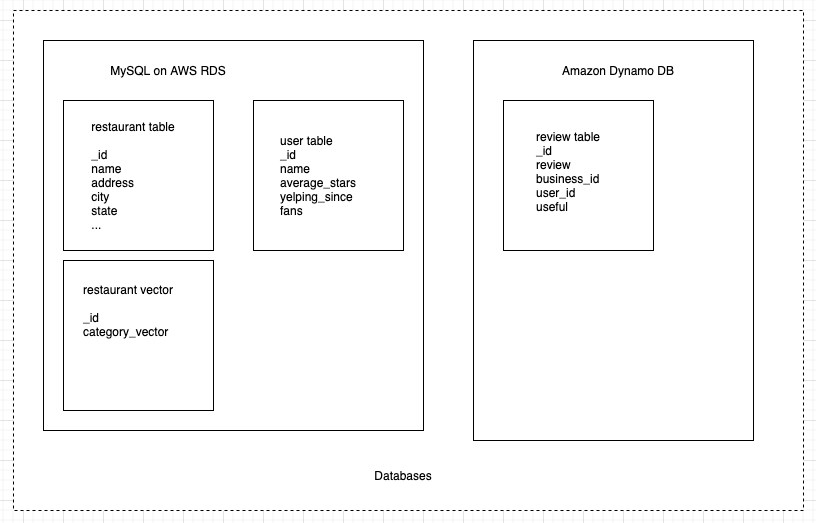

# RSBY
A Recommender System Based on YELP Open Dataset


## Core tech stack
- Node.js
- PySpark (Apache Spark in Python)
- MySQL / DynamoDB


## Installation
Make sure Node.js and NPM are installed beforeband
```bash
git clone https://github.com/En0chWang/DSCI551-Project.git
cd DSCI551-Project
npm install
npm start
```

## Databases



## APIs
| API                                                                         | Description                                                            |
|-----------------------------------------------------------------------------|------------------------------------------------------------------------|
| localhost:5000/recommender/top10restaurants?{catgory, price, rating, city, state} | Get the top 10 restaurants based on category, price, rating, and city. |
| localhost:5000/recommender/reviews?{business_id}                            | Get restaurant reviews given restaurant id.                            |
| localhost:5000/recommender/top10users?{restaurants}                         | Get top 10 user recommendations based on the search result.            |

## License
[MIT](https://choosealicense.com/licenses/mit/)
